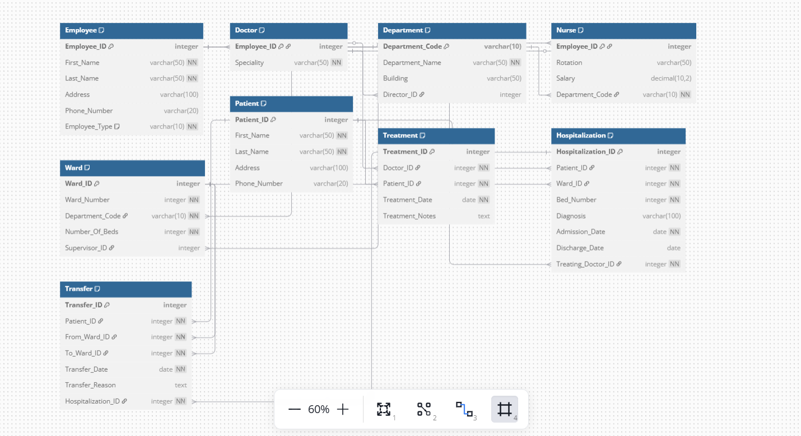
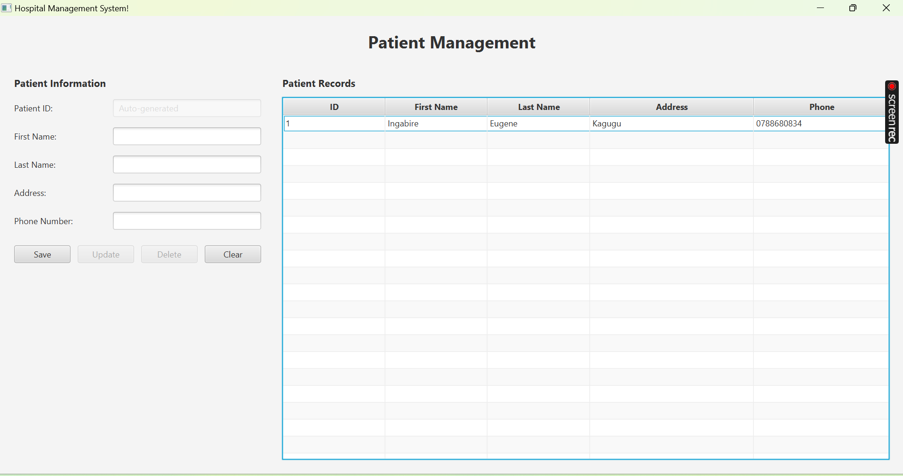

# Hospital Management System

A comprehensive hospital information system that models departments, wards, employees (doctors and nurses), patients, treatments, and hospitalizations. This project implements a complete database schema, JDBC connectivity, and a JavaFX user interface for managing hospital data.


## Table of Contents
- [Features](#features)
- [System Design](#system-design)
    - [Database Schema](#database-schema)
    - [Application Architecture](#application-architecture)
- [Technologies Used](#technologies-used)
- [Setup & Installation](#setup--installation)
- [Usage Guide](#usage-guide)
- [Project Structure](#project-structure)
- [Database Normalization](#database-normalization)
- [Implementation Details](#implementation-details)
- [Contributing](#contributing)

## Features

- **Department Management**: Track hospital departments with directors and building locations
- **Employee Management**: Manage doctors and nurses with specialized information for each
- **Ward Management**: Organize hospital wards by department with bed capacity tracking
- **Patient Management**: Complete CRUD operations for patient records
- **Treatment Tracking**: Record treatments provided by doctors to patients
- **Hospitalization Management**: Track patient admissions, bed assignments, and diagnoses
- **Patient Transfer System**: Monitor patient movements between wards with transfer reasons

## System Design

### Database Schema

The database design follows the Third Normal Form (3NF) and implements proper relationships between entities as shown in the Entity-Relationship Diagram below:



#### Key Entities and Relationships:
- **Employee** is the superclass for both **Doctor** and **Nurse**
- **Department** contains multiple **Wards** and is directed by a **Doctor**
- **Ward** is supervised by a **Nurse** and belongs to a **Department**
- **Patient** can be hospitalized in a **Ward** and treated by **Doctors**
- **Transfer** records movement of **Patients** between **Wards**

### Application Architecture

The application follows a layered architecture pattern:


- **Model Layer**: Domain objects representing business entities
- **DAO Layer**: Data Access Objects for database operations
- **Service Layer**: Business logic and transaction management
- **View Layer**: JavaFX UI for user interaction

## Technologies Used

- **Java 21**: Core programming language
- **JavaFX**: UI framework
- **JDBC**: Database connectivity
- **PostgreSQL**: Relational database
- **Maven**: Dependency management and build tool
- **Java Module System**: For modular application architecture

## Setup & Installation

### Prerequisites
- Java Development Kit (JDK) 11 or higher
- PostgreSQL 12 or higher
- Maven 3.6 or higher

### Database Setup
1. Create a PostgreSQL database named `HospitalManagementSystemDb`:
```sql
CREATE DATABASE HospitalManagementSystemDb;
```

2. Execute the database schema script to create tables and constraints:
```bash
psql -U postgres -d HospitalManagementSystemDb -f database/schema.sql
```

### Application Setup
1. Clone the repository:
```bash
git clone https://github.com/ingabireol/HospitalManagementSystem.git
cd HospitalManagementSystem
```

2. Configure database connection:
   Edit `src/main/java/olim/com/hospitalmanagementsystem/util/DatabaseUtil.java` with your PostgreSQL credentials.

3. Build the application:
```bash
mvn clean package
```

4. Run the application:
```bash
mvn javafx:run
```

## Usage Guide

### Patient Management

The current implementation includes a complete patient management module with the following features:

1. **View All Patients**: The main screen displays a table of all patients in the system
2. **Add New Patient**: Fill in the patient information form and click "Save"
3. **Update Patient**: Select a patient from the table, modify details, and click "Update"
4. **Delete Patient**: Select a patient and click "Delete" (confirmation required)
5. **Clear Form**: Reset the form to add a new patient



## Project Structure

```
src/
├── main/
│   ├── java/
│   │   ├── module-info.java
│   │   └── olim/
│   │       └── com/
│   │           └── hospitalmanagementsystem/
│   │               ├── HospitalMain.java
│   │               ├── model/
│   │               │   ├── Doctor.java
│   │               │   ├── Employee.java
│   │               │   ├── Department.java
│   │               │   ├── Hospitalization.java
│   │               │   ├── Nurse.java
│   │               │   ├── Patient.java
│   │               │   ├── Treatment.java
│   │               │   ├── Transfer.java
│   │               │   └── Ward.java
│   │               ├── dao/
│   │               │   ├── PatientDAO.java
│   │               │   └── impl/
│   │               │       └── PatientDAOImpl.java
│   │               ├── service/
│   │               │   ├── PatientService.java
│   │               │   └── impl/
│   │               │       └── PatientServiceImpl.java
│   │               ├── util/
│   │               │   └── DatabaseUtil.java
│   │               └── view/
│   │                   └── PatientController.java
│   └── resources/
│       └── olim/
│           └── com/
│               └── hospitalmanagementsystem/
│                   └── patient-view.fxml
├── test/ 
│   └── java/
│       └── olim/
│           └── com/
│               └── hospitalmanagementsystem/
│                   ├── dao/
│                   │   └── PatientDAOTest.java
│                   └── service/
│                       └── PatientServiceTest.java
└── database/
    ├── schema.sql
    └── sample_data.sql
```

## Database Normalization

The database schema is normalized to the Third Normal Form (3NF) to eliminate redundancy and ensure data integrity:

### First Normal Form (1NF)
- All tables have primary keys
- All columns contain atomic values
- No repeating groups

### Second Normal Form (2NF)
- Meets 1NF requirements
- All non-key attributes are fully dependent on the primary key
- Composite keys properly managed (e.g., Ward has a composite key of Ward_Number and Department_Code)

### Third Normal Form (3NF)
- Meets 2NF requirements
- No transitive dependencies (non-key attributes dependent on other non-key attributes)
- Proper separation of entities (e.g., Doctor and Nurse as subtypes of Employee)

## Implementation Details

### Database Indexing Strategy

The application uses strategic database indexing to optimize query performance:

```sql
CREATE INDEX idx_employee_type ON Employee(Employee_Type);
CREATE INDEX idx_nurse_department ON Nurse(Department_Code);
CREATE INDEX idx_ward_department ON Ward(Department_Code);
CREATE INDEX idx_hospitalization_patient ON Hospitalization(Patient_ID);
CREATE INDEX idx_hospitalization_ward ON Hospitalization(Ward_ID);
CREATE INDEX idx_treatment_doctor ON Treatment(Doctor_ID);
CREATE INDEX idx_treatment_patient ON Treatment(Patient_ID);
CREATE INDEX idx_transfer_hospitalization ON Transfer(Hospitalization_ID);
```

These indexes improve performance for common queries such as:
- Finding all doctors or nurses
- Finding nurses in a specific department
- Finding wards in a department
- Finding hospitalizations for a patient
- Finding treatments by a specific doctor

### Transaction Management

The application implements proper transaction management through the `DatabaseUtil` class:

```java
// Start transaction
conn.setAutoCommit(false);

try {
    // Perform operations...
    
    // Commit transaction on success
    DatabaseUtil.commitTransaction();
} catch (SQLException e) {
    // Rollback transaction on error
    DatabaseUtil.rollbackTransaction();
    throw e;
}
```


## Contributing

Contributions to the Hospital Management System are welcome. Please follow these steps:

1. Fork the repository
2. Create a feature branch (`git checkout -b feature/amazing-feature`)
3. Commit your changes (`git commit -m 'Add some amazing feature'`)
4. Push to the branch (`git push origin feature/amazing-feature`)
5. Open a Pull Request
